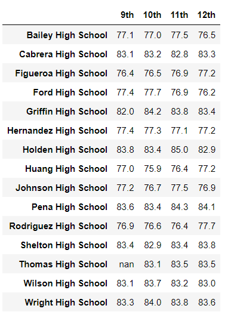

# School_District_Analysis
## Overview of the school district analysis
The purpose of this project was to analyze the data, from Excel, of the students of a single district from different schools. For the individual schools, I was given varaibles such as budget, school size, and school type (charter or district). Moreover, I was given the amount of total students who passed math, passed reading, and passed both subjects. The primary products of my project was the ranking of each school in the district based on overall passing percentages of both math and reading and the average passing percentages of all students grouped by grade, school spending per student, school size, and school type. Additionally, once it was discovered that the 9th grade passing rates from a certain school was tampered with, I then created new data set that removed only the data values of the students whos grades were false and created new analysis dataframes using the new amount of total students. 
## Results
## District Summaries
### District Summary All

### District Summary No 9th

Since only students from 9th grade and from Thomas High School were removed, the entire district percentages are not changed much since comparatively, the amount of students in the district is far greater than that of the removed party. The total amount of students remain the same however, the overall passing rates changes since there were still some of the 9th graders in Thomas High Schoolers who would have passed. When their scores get removed, the total amount of students who passed will lower while the total students remains and therefore the percentage of students who passed will decrease when the scores of the 9th graders from Thomas High School are removed. 

## School Summaries
### School Summary all

### School Summary No 9th

The only values that are changed from the School Summaries are the ones from Thomas High School. All other schools keep the same values since their data is untampered with. In the original School Summary that kept the 9th grade values, the passing percentages is around 60 percent. When the 9th graders are removed, the percentages of passing rates at Thomas High School becomes significantly higher to almost 90 percent. These percentage values of Thomas High School uses the passing amount and total amount of students only in 10th, 11th, and 12th grade. 

## High School Performance
When the values for 9th graders in Thomas High School are kept in the data set, Thomas High School is one of the lowest performing schools. As stated before, the original passing percentages lies around 60 percent for Thomas High School. However, when the false 9th grade values are omitted, Thomas High School passing percentages rises greatly, and when only considering 10th, 11th and 12th grade, Thomas High School is one of the top high schools in the district.

## Scores by Grade
### Math 

### Reading

When reviewing the Passing Scores by each grade, the only values that show NaN are those of the 9th graders at Thomas High School. When looking at the 9th grade column, all values for other schools shows some value and when looking at the Thomas High School row, all values for other grades shows some value. Therefore, the only values that are removed from the data set are those from 9th grade and from Thomas High School, not 9th grade or Thomas High School.

## Scores by Spending
### Spending Ranges All

### Spending Ranges No 9th

I note that Thomas High School lies in the Spending Range between 631 and 645 dollars. When analyzing the data tables, all rows that separate the different Spending Ranges remain the same except for the 631-645. This is because only the values at Thomas High School were changed and therefore the other values and percentages should remain equal. 

## Scores by Size
### School Size All

### School Size No 9th

I note that Thomas High School lies in the Size Range between 1000 and 1900 students. When analyzing the data tables, all rows that separate the different School Size Ranges remain the same except for the 1000-1900. This is because only the values at Thomas High School were changed and therefore the other values and percentages should remain equal. 

## Scores by Type
### School Type All

### School Type No 9th

I note that Thomas High School is a Charter School. When analyzing the data table, the District School row remains the same, but the Charter School row does not. This is because only the values at Thomas High School were changed and therefore the other values and percentages should remain equal. 

## Summary
## 4 Changes
### Values of 9th Graders at Thomas High School
As noted before, all of the values for 9th Graders at Thomas High School were replaced with Nan. Both reading and math were taken out. Again, it is important to note that from Thomas High School, all other grades kept their values and from the 9th graders, all other schools kept their values. 
### Passing Percentages at Thomas High School
With the original data set, the passing percentages for Thomas High School was around 60 percent. The updated school district analysis shows a major change in the passing percentages at Thomas High School and afterwards, Thomas High School is to be understood as one of the best high schools in the district. 
### Passing Percentage by School Size
Thomas High School has between 1000 and 1900 students. When analyzing the passing rates of reading and math, not only are the values of schools in the subcategory of 1000-1900 different, but for the table including the 9th graders from Thomas High School, the passing math rates is higher while the passing reading rates are lower. Therefore I cannot generalize that removing the tampered with values will guarentee a higher or lower passing rate for either subject. This is because The amount of passes in reading as opposed to math differs from the 9th graders in Thomas High School. Therefore, by making all values, both readind and math, become Nan, the impact will have different magnitudes.
### Passing Percentages by School Type
There are only two types of schools, Charter and District. Thomas High School is a Charter School. With only two subcategories for the schools to fall into, it is clear to see that all values of passing percentages for subcategories that do not include Thomas High School will remain the same, however all values of the subcategory with Thomas High School will change since the previous data set is adjusted only for those cases.
